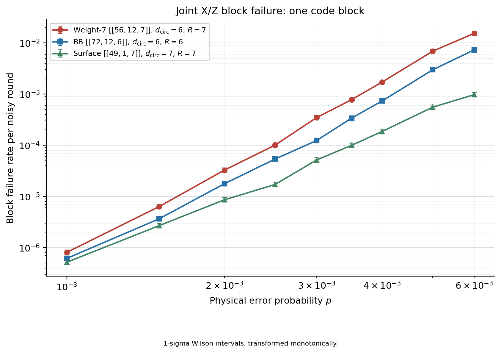

# Weight-7 Quantum Error Correction Experiments

Circuit-level simulations of same-shot joint X/Z logical failure, schedule screening, and independent confirmation for the weight-7 `[[56,12,7]]` code. The comparison campaign also includes BB `[[72,12,6]]` and rotated surface `[[49,1,7]]` codes.

This repository contains runnable experiment sources, seven saved figures in PNG and PDF, and the small result snapshots needed to reproduce those figures. Large detector-error models, generated circuits, virtual environments, and simulation caches are excluded.

## Experiments

| Directory | Purpose | Saved results |
| --- | --- | --- |
| [Joint memory](experiments/joint_memory/) | Compare weight-7, BB72, and surface d=7 with joint X/Z decoding | 27 points; five figures |
| [Schedule scan](experiments/schedule_scan/) | Screen alternative weight-7 CNOT schedules before simulation | 24 points; one comparison figure |
| [Independent confirmation](experiments/high_slope/) | Independently evaluate historically selected schedules and the baseline | 8 points; one confirmation figure |



See the [figure gallery](artifacts/README.md) for all PNG previews and vector PDFs, and [data notes](data/README.md) for snapshot provenance and limitations.

## Reproduce the figures

From the repository root, with Python 3.10 or newer:

```bash
python -m venv .venv
source .venv/bin/activate
python -m pip install -r requirements-plot.txt
python scripts/reproduce_figures.py
```

On Windows, activate with `.venv\Scripts\Activate.ps1` in PowerShell. Reproduced files go to `generated/figures/`, leaving the supplied figures intact. To render a single experiment:

```bash
python scripts/reproduce_figures.py --experiment schedule_scan
```

Figure regeneration reads the saved observations; it does not rerun Monte Carlo simulations or certify distance proofs. Full simulation requires the dependencies and Linux execution instructions in each experiment's README.

## Layout and integration

```text
experiments/       Three self-contained experiment programs
data/              Saved counts, settings, distance records, and summary tables
artifacts/         Supplied PNG/PDF figures
scripts/           Repository-level figure reproduction entry point
docs/              Integration guidance and scientific provenance
licenses/          Preserved third-party license text
```

The duplicate archive nesting has been removed. Each experiment retains its own local modules and required inputs so it can run independently. [Integration notes](docs/INTEGRATION.md) explain what to move together and how to avoid module-name collisions when incorporating this repository into a larger project.

## Interpretation

The joint-memory and scan figures report failure per code block per noisy round. The independent-confirmation figure uses an equivalent rate per logical qubit per round; that normalization is not a measured marginal error rate. Error bars are nominal Wilson intervals, and adaptive stopping does not guarantee nominal coverage. Distance labels describe the saved evidence for the specific circuits. See each experiment's README before drawing comparisons across campaigns.

Source attribution and model conventions are documented in [Provenance](docs/PROVENANCE.md). The supplied [IBM source license](licenses/IBM_SOURCE_LICENSE.txt) is preserved.
