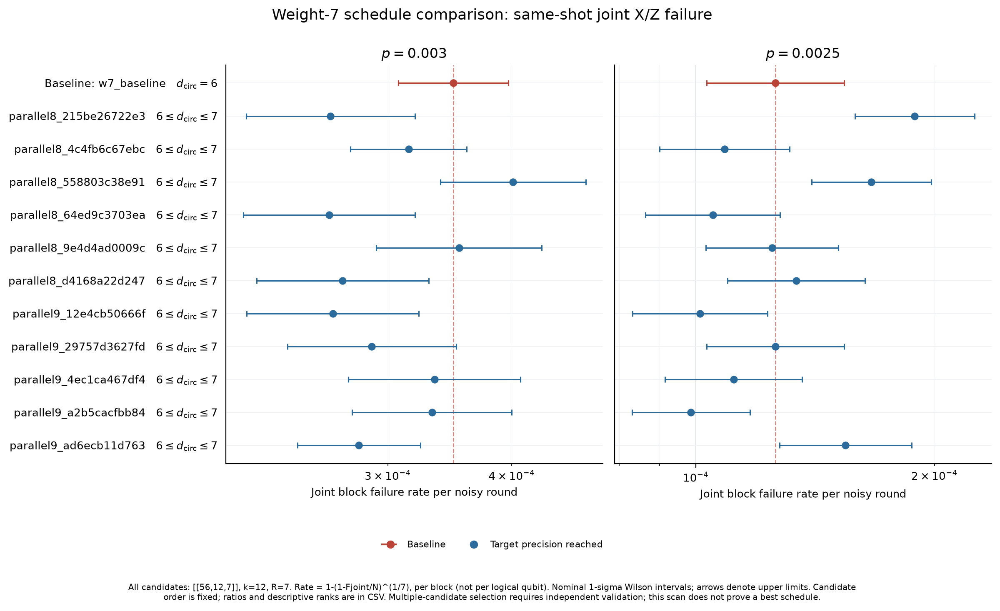
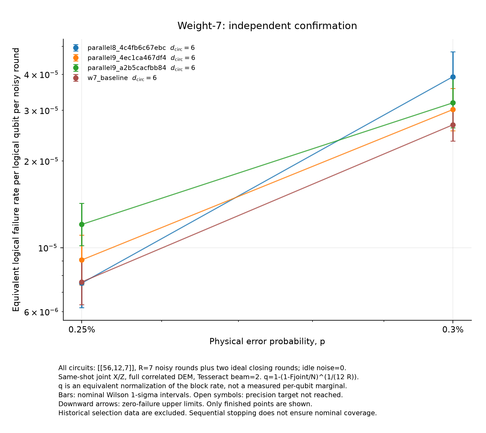

# Figure gallery

The seven supplied figures are preserved in PNG for browsing and PDF for reuse. The [saved data](../data/) and [reproduction script](../scripts/reproduce_figures.py) accompany them. Generated copies go to `generated/figures/` by default.

## Joint memory

| Figure | PNG | PDF |
| --- | --- | --- |
| One code block, nominal one-sigma intervals | [PNG](joint_memory/joint_one_block_1sigma.png) | [PDF](joint_memory/joint_one_block_1sigma.pdf) |
| One code block, point estimates | [PNG](joint_memory/joint_one_block_points.png) | [PDF](joint_memory/joint_one_block_points.pdf) |
| Equal 12-logical-qubit capacity, nominal one-sigma intervals | [PNG](joint_memory/joint_equal_k12_1sigma.png) | [PDF](joint_memory/joint_equal_k12_1sigma.pdf) |
| Equal 12-logical-qubit capacity, point estimates | [PNG](joint_memory/joint_equal_k12_points.png) | [PDF](joint_memory/joint_equal_k12_points.pdf) |
| X and Z sector views | [PNG](joint_memory/sectors_X_then_Z_1sigma.png) | [PDF](joint_memory/sectors_X_then_Z_1sigma.pdf) |

The equal-capacity view converts the surface-code result to twelve independent patches. Its failure definition differs from a single surface-code patch. See the [experiment notes](../experiments/joint_memory/README.md).

## Schedule scan

[PNG](schedule_scan/comparison.png) · [PDF](schedule_scan/comparison.pdf) · [Experiment notes](../experiments/schedule_scan/README.md)

The panels compare twelve schedules at two physical error probabilities. They show block failure per noisy round; descriptive ranking does not establish a globally best schedule.

## Independent confirmation

[PNG](high_slope/independent_confirmation.png) · [PDF](high_slope/independent_confirmation.pdf) · [Experiment notes](../experiments/high_slope/README.md)

This figure uses `q = 1 - (1 - Fjoint/N)^(1/(kR))`, an equivalent normalization per logical qubit per round. It is not a measured single-logical-qubit marginal. The observations come from a separate confirmation run and exclude historical selection counts.
